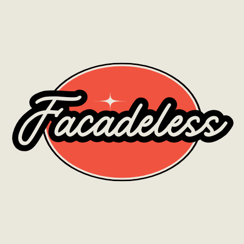

    
    

        
        
        
        
         
    

------

> This package was heavily inspired by [openai-php/client](https://github.com/openai-php/client). Consider giving it a
> start to support the PHP community!

# Facadeless

PHPStan plugin for enforcing facade rules within your Laravel projects.